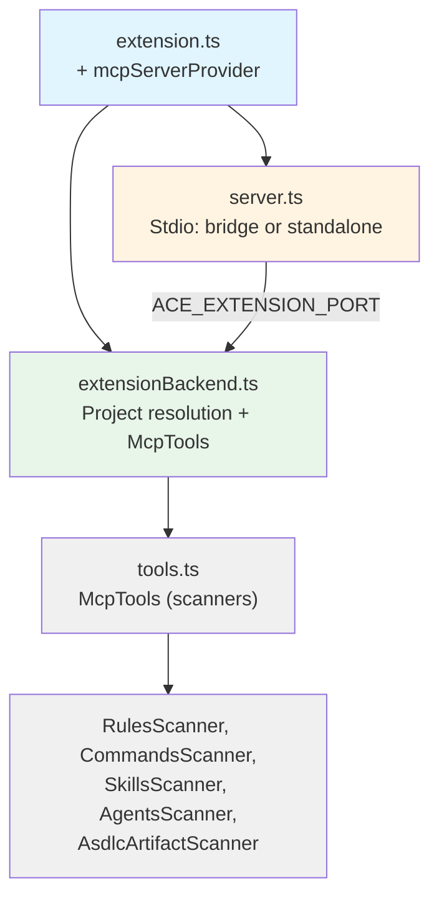

# Feature: MCP Server Integration

> **ASDLC Pattern**: [The Spec](https://asdlc.io/patterns/the-spec/)
> **Status**: Active
> **Last Updated**: 2026-03-26

---

## Blueprint

### Context

The MCP (Model Context Protocol) server exposes ACE's scanning capabilities as **tools** (commands) that AI agents can invoke dynamically. Instead of static JSON exports, agents request context on-demand through structured tool calls.

**Problem solved**: AI agents need dynamic access to project context (rules, commands, skills, ASDLC artifacts) without requiring static export files that become stale. MCP provides a standardized protocol for context access.

**Multi-project**: ACE operates over multiple projects (workspaces and added roots). The MCP surface is **multi-project by design**: agents discover available projects via `list_projects` and then address them by a short `projectKey` (the final directory name in the project path) instead of passing full filesystem paths.

**Exposed surface**: The server exposes **only MCP tools (commands)**. It does **not** expose MCP resources (e.g. `ace://` URIs) to agents. All context is obtained by invoking tools (e.g. `list_rules`, `get_rule`, `get_project`). This keeps the agent contract simple and avoids duplicating the same data as both tools and resources.

**Design principle**: MCP is a **thin adapter** over scanners. When run from the extension, **project resolution and scanning stay in the extension** (same source of truth as the tree view); the stdio server is a **protocol bridge** that forwards tool calls to the extension. No business logic in the bridge—just MCP ↔ extension IPC.

### Architecture

#### MCP Server Components



- **Extension**: Registers MCP server definition and starts the **extension backend** (TCP listener). Passes `ACE_EXTENSION_PORT` to the stdio server so it runs in **bridge mode**.
- **Extension backend**: Builds project list (workspace + `ProjectManager.getProjects()`), resolves `projectKey` → path, and runs **McpTools** (same scanners as the tree). Single source of truth for project hierarchy.
- **Stdio server** (`server.ts`): If `ACE_EXTENSION_PORT` is set, **bridge mode**—forwards every tool call to the extension backend and returns the result. Otherwise **standalone mode**—uses `ACE_PROJECT_PATHS` or single workspace and runs scanners in-process (no extension).

#### Dual Integration Modes

**Mode 1: Extension + bridge (preferred when using Cursor/VS Code with ACE)**
- Extension starts the **backend** (project resolution + tool handlers) and the **stdio server** with `ACE_EXTENSION_PORT`.
- Stdio server forwards tool calls to the backend; **project key lookup and scanning run in the extension** (same data as the tree view).
- Tools automatically available in Cursor chat; added projects (e.g. Agency) are resolved and scanned by the extension.

**Mode 2: Standalone server (fallback)**
- Runs as subprocess via stdio; configured in `.cursor/mcp.json` or `~/.cursor/mcp.json`.
- No extension: server uses `ACE_PROJECT_PATHS` env (if provided) or single workspace path. Project resolution and scanning run in-process.
- Works when Extension API is unavailable or when invoking the server directly.

### Tool Registry (Only Exposed Surface)

Agents interact with ACE **only** via these tools. No MCP resources are registered.

| Tool | Description | Input | Output |
|------|-------------|-------|--------|
| `list_projects` | List registered ACE projects | _none_ | `ProjectInfo[]` (includes `projectKey`, `path`, `label`) |
| `list_rules` | List all Cursor rules | `projectKey?` | `RuleInfo[]` |
| `get_rule` | Get full rule content | `name`, `projectKey?` | `RuleContent` |
| `list_commands` | List workspace + global commands | `projectKey?` | `CommandInfo[]` |
| `get_command` | Get full command content | `name`, `projectKey?` | `CommandContent` |
| `list_skills` | List workspace + global skills | `projectKey?` | `SkillInfo[]` |
| `get_skill` | Get full skill content | `name`, `projectKey?` | `SkillContent` |
| `list_agents` | List agent definition files | `projectKey?` | `AgentDefinitionInfo[]` |
| `get_agent` | Get full agent definition content | `name`, `projectKey?` | `AgentDefinitionContent` |
| `list_specs` | List available specifications (`specs/*/spec.md`) | `projectKey?` | `SpecFile[]` |
| `get_spec` | Get full `spec.md` for one domain | `name`, `projectKey?` | `SpecContent` |
| `get_project` | Complete project snapshot (rules, commands, skills, agents, ASDLC artifacts) | `projectKey?` | `ProjectContext` |

**Tool Input (multi-project)**:
- `list_projects` returns the set of known projects, each with a stable `projectKey` (the final directory segment of the project path).
- Every other tool accepts optional `projectKey`.
- If omitted, tools use the \"current\" project (current workspace or default ACE project).
- When provided, tools resolve `projectKey` to a project root and query that project. If multiple projects share the same final directory name, ACE may disambiguate by label or return a clear error.

**Tool Output Pattern**:
- Returns JSON-serializable typed objects.
- Empty results (e.g., no rules) return empty arrays, not errors.
- Errors return `{ isError: true, message: string }`.

### Resources: Not Exposed

The MCP server **does not** register or advertise MCP resources (e.g. `ace://rules`, `ace://commands`, `ace://skills`, `ace://agents-md`, `ace://specs`, `ace://schemas`). Agents obtain all context by calling tools. Internal or extension-only use of URI-like identifiers is out of scope for this spec.

### Type System

The MCP layer maintains its own type definitions that map to scanner types:

**Scanner → MCP Mapping**:
```typescript
// Scanner type (internal)
Rule { uri, fileName, metadata, content }

// MCP type (external)
RuleInfo { name, description, type, path, globs? }
RuleContent { ...RuleInfo, content }
```

**Design principle**: MCP types are **flattened and simplified** for agent consumption. Internal complexity (URI objects, VS Code types) is hidden.

### Anti-Patterns

#### ❌ Business Logic in MCP Layer
**Problem**: Adding validation, transformation, or complex logic in MCP server.
**Why it fails**: MCP should be a thin protocol adapter. Logic belongs in scanners.
**Solution**: MCP tools simply call scanner methods and format results.

#### ❌ Caching Scanner Results
**Problem**: Storing scanner results in memory to avoid re-scanning.
**Why it fails**: Stale data—files change frequently during development.
**Solution**: Always call scanners fresh. Scanners are fast enough for dynamic invocation.

#### ❌ Mixing Extension and Server Logic
**Problem**: Shared code between extension MCP registration and standalone server.
**Why it fails**: Different lifecycles—extension runs in host, server as subprocess.
**Solution**: Standalone server (`src/mcp/server.ts`) implements Node.js-based scanners independently.

#### ❌ Exposing MCP Resources for Context
**Problem**: Registering `ace://` resources so agents can read context via resource URIs.
**Why we avoid it**: Duplicates the tool surface; agents should use tools only for a single, clear contract.
**Solution**: Expose only tools; agents call `list_*` / `get_*` / `get_project`.

---

## Contract

### Definition of Done

- [ ] MCP server registers successfully via Cursor Extension API
- [ ] Fallback standalone server runs via stdio transport
- [ ] All tools (`list_rules`, `get_rule`, etc.) callable from agent
- [ ] **Only tools are exposed; no MCP resources are registered.**
- [ ] Tools accept optional `projectKey` and return context for the specified project (multi-project), and `list_projects` exposes the available keys.
- [ ] Tools return correct typed responses matching spec
- [ ] `get_project` aggregates all scanner results for the given project
- [ ] Tools handle missing artifacts gracefully (empty results, not errors)
- [ ] Integration tests verify tool invocations and responses

### Regression Guardrails

**Critical invariants that must never break:**

1. **Stateless tools**: Tools MUST NOT maintain state between invocations. Always scan fresh.

2. **Error handling**: Tools MUST return `{ isError: true, message }` for errors, never throw uncaught exceptions.

3. **Type consistency**: Tool outputs MUST match declared MCP types exactly. No `any` or dynamic fields.

4. **Scanner independence**: MCP layer MUST NOT modify scanner behavior. Tools are adapters only.

5. **Empty vs Error**: Missing artifacts MUST return empty arrays/objects with `exists: false`, not errors.

6. **Tools-only surface**: The MCP server MUST NOT register MCP resources for rules, commands, skills, AGENTS.md, specs, or schemas. Context is provided only via tool calls.

### Scenarios

**Scenario: Agent requests all rules**
- **Given**: Workspace has 3 rules in `.cursor/rules/`
- **When**: Agent invokes `list_rules` tool
- **Then**: Returns array of 3 `RuleInfo` objects with name, description, type, path

**Scenario: Agent requests specific rule**
- **Given**: Rule `security.mdc` exists with content
- **When**: Agent invokes `get_rule` with `name: "security"`
- **Then**: Returns `RuleContent` with full content and metadata

**Scenario: Agent requests rule that doesn't exist**
- **Given**: No rule named `missing.mdc`
- **When**: Agent invokes `get_rule` with `name: "missing"`
- **Then**: Returns `null` (not error)

**Scenario: Agent requests complete project snapshot**
- **Given**: Workspace has rules, commands, skills, and AGENTS.md
- **When**: Agent invokes `get_project`
- **Then**: Returns `ProjectContext` with all artifacts, timestamp, and projectPath

**Scenario: Agent reads one living spec file**
- **Given**: `list_specs` includes domain `mcp` pointing at `specs/mcp/spec.md`
- **When**: Agent invokes `get_spec` with `name: "mcp"` (or a path fragment)
- **Then**: Returns `SpecContent` with full markdown body and metadata fields

**Scenario: Multi-project context discovery and access**
- **Given**: Multiple projects configured in ACE
- **When**: Agent invokes `list_projects` to discover available projects, then calls a tool with `projectKey: "other-project"`
- **Then**: Returns context for the specified project, not current workspace

**Scenario: Agent lists skills via tool (no resource URI)**
- **Given**: Workspace has 3 skills in `.cursor/skills/`
- **When**: Agent invokes `list_skills` tool
- **Then**: Returns JSON array with 3 skill objects (name, title, overview, location, path)

**Scenario: Agent reads specific skill via tool**
- **Given**: Skill `create-plan` exists with SKILL.md content
- **When**: Agent invokes `get_skill` with `name: "create-plan"`
- **Then**: Returns full SKILL.md content and metadata via tool response

---

## Implementation Reference

### Files

| Component | Location |
|-----------|----------|
| Extension MCP registration | `src/extension.ts` |
| Standalone MCP server | `src/mcp/server.ts` |
| MCP tool handlers | `src/mcp/tools.ts` |
| MCP type definitions | `src/mcp/types.ts` |

### Configuration

**Cursor Extension API** (automatic):
```typescript
// src/extension.ts
vscode.mcp.registerServer('ace', {
  name: 'Agent Context Explorer',
  description: 'Project context tools'
});
```

**Standalone Server** (manual):
```json
// .cursor/mcp.json or ~/.cursor/mcp.json
{
  "mcpServers": {
    "ace": {
      "command": "node",
      "args": ["<extension-dir>/out/mcp/server.js", "<workspace-root>"]
    }
  }
}
```

### Tests

| Test Suite | Location |
|------------|----------|
| MCP server scanners | `test/suite/unit/mcpServer.test.ts` |
| MCP types | `test/suite/unit/mcpTypes.test.ts` |

---

**Status**: Active  
**Last Updated**: 2026-03-23  
**Pattern**: ASDLC "The Spec"
