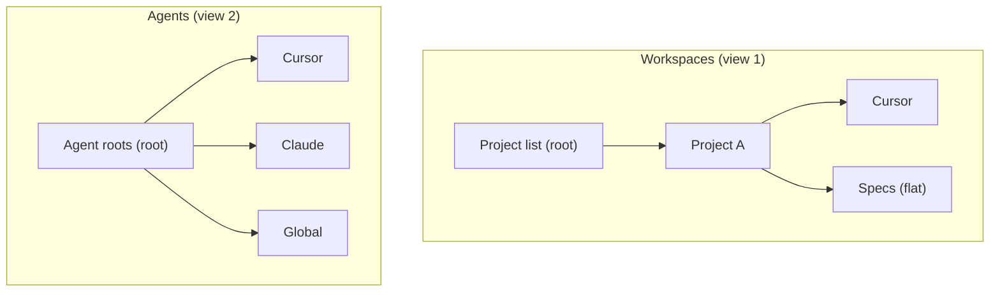

# Feature: Tree View

> **ASDLC Pattern**: [The Spec](https://asdlc.io/patterns/the-spec/)
> **Status**: Active
> **Last Updated**: 2026-03-26

---

## Blueprint

### Context

The tree view is the primary way users inspect workspace and agent context in the sidebar. It presents two separate concerns: **workspace projects** (what applies to each added project) and **agent context** (what applies across the tool—e.g. Cursor, Claude, or a shared global folder). Keeping these as separate views avoids mixing project-scoped and global context.

**Problem solved**: Users need to see project-specific artifacts (rules, commands, skills, specs, schemas) without global noise, and separately to see shared agent context (commands, skills from home-directory layouts). One tree mixing both is confusing; two views with clear boundaries fixes that.

**Design principles**:
- **Two roots, not two nodes under one root.** Workspaces and Agents are separate sidebar views (separate trees), each with its own root. Workspace view = project list + per-project structure. Agents view = agent roots (e.g. Cursor, Claude) + Global, when those directories exist.
- **Workspace view is project-only.** Under each project, **Cursor** shows that workspace’s commands, rules, skills, and **Agent definitions** (flat `*.md` in `.cursor/agents/`, hubot icon; alphabetical with the other Cursor sections). No “workspace vs global” split under the project. A sibling **Specs** node (library icon) lists living specs from `specs/*/spec.md` in a **flat** list (same level as **Cursor** — no nested Specs/Schemas folders, no `schemas/` in the tree). It does not surface root-level constitution files (e.g. `AGENTS.md`) or Speckit nodes. See [004-agents-view-scan](../004-agents-view-scan/spec.md) for agent-definition contracts and edge cases.
- **Agents view is read-only and additive.** It shows whatever agent roots exist (e.g. Cursor, Claude) and a Global node for the shared agents directory. Under each root, the same structural categories (Commands, Skills, etc.) plus an **Agents** subsection (hubot icon) for flat `*.md` agent definitions in that root’s `agents/` directory (e.g. `~/.cursor/agents`). Toolbar: Refresh only. No “Add” in the Agents view.
- **Viewer-only.** The tree never creates, edits, or deletes artifacts. Users open or edit in their own editors.

### Architecture

#### Two Views

- **Workspaces**: Root = list of added projects (no “Workspaces” wrapper). Per project: **Cursor** (local commands, rules, skills, **Agents** / agent definitions), **Specs** (flat list of `specs/*/spec.md`). Toolbar: Add (add project), Refresh.
- **Agents**: Root = one node per existing agent root (e.g. Cursor, Claude) plus Global when that directory exists. Under each: same structure (Commands, Skills, **Agents**, etc.). Toolbar: Refresh only.

#### Workspace Branch (per project)

Under each project, the tree does not show global commands or skills. **Cursor** shows Commands, Rules, Skills, and **Agents** (agent-definition files) from that project only, ordered alphabetically by section label. The **Specs** node is a **single collapsible sibling** beside Cursor; expanding it lists spec domains (`specs/<domain>/spec.md`) directly — no intermediate nested folders and no `schemas/` in the tree.

#### Agents Branch

Agent roots (e.g. Cursor, Claude) and Global are known directories; each is shown only if it exists. Under each, the same categories (Commands, Skills, **Agents**, etc.) are used so behavior is consistent. Data comes from scanners; the view only reflects what is on disk.

### Anti-Patterns

#### ❌ One tree with “Workspaces” and “Global” as siblings under one root
**Problem**: Treating global as a sibling of the project list under a single tree.
**Why it fails**: One view doing two jobs; toolbar and semantics get mixed (e.g. Add on a global pane).
**Solution**: Two views. Workspace view root = project list. Agents view root = agent roots + Global.

#### ❌ Showing global commands/skills under each project’s Cursor section
**Problem**: Under a project, expanding Cursor to “Workspace commands” and “Global commands”.
**Why it fails**: Blurs project scope; global context belongs in the Agents view.
**Solution**: Under a project, Cursor shows only that workspace’s commands and skills.

#### ❌ Add or mutate from the Agents view
**Problem**: “Add project” or any create/edit/delete in the Agents view.
**Why it fails**: Agent view reflects existing layout; only Refresh is needed.
**Solution**: Add (and project list management) only in the Workspace view. Agents view: Refresh only.

#### ❌ Tree items that create, edit, or delete artifacts
**Problem**: Tree actions that modify rules, commands, skills, or specs.
**Why it fails**: Viewer-only; users edit in their own editors.
**Solution**: Tree only navigates and opens; no CRUD from the tree.

---

## Contract

### Definition of Done

- [ ] Two distinct sidebar views: Workspaces and Agents (separate trees).
- [ ] Workspace view root shows the project list only; toolbar has Add and Refresh.
- [ ] Under each project: Cursor (local commands, rules, skills, **Agents** / agent definitions only), Specs (flat `specs/` list).
- [ ] Agents view root shows agent roots (e.g. Cursor, Claude) + Global when directories exist; toolbar has Refresh only.
- [ ] Under each agent root and Global: same structural categories (Commands, Skills, **Agents**, etc.).
- [ ] Empty and missing-artifact cases show clear empty/unavailable state, no user-facing errors.
- [ ] Tree is view-only (no create/edit/delete of artifacts from the tree).

### Regression Guardrails

**Critical invariants that must never break:**

1. **Two views, two roots.** Workspace view and Agents view are separate contributions; neither is a child of the other.

2. **Project scope in workspace view.** Under a project, Cursor MUST show only that project’s commands and skills. No global subsection under the project.

3. **Agents view is additive.** Only show agent roots and Global when the corresponding directories exist. Missing directories MUST NOT produce errors.

4. **Toolbar split.** Add (add project) MUST NOT appear in the Agents view. Refresh MAY appear in both views and MUST refresh only the data for that view.

5. **Viewer-only.** Tree MUST NOT offer create, edit, or delete for rules, commands, skills, or specs.

### Scenarios

**Scenario: User opens Workspace view**
- **Given**: At least one project is added
- **When**: User opens the Workspaces view
- **Then**: Root shows the project list (no wrapper node); expanding a project shows Cursor and Specs

**Scenario: User expands Cursor under a project**
- **Given**: Project has local commands, rules, skills, and optional `.cursor/agents/*.md`
- **When**: User expands Cursor
- **Then**: Sections include Commands, Rules, Skills, and **Agents** (alphabetical); each section is project-local only (no workspace vs global under the project)

**Scenario: User opens Agents view**
- **Given**: At least one of Cursor, Claude, or Global directory exists
- **When**: User opens the Agents view
- **Then**: Root shows one node per existing root; toolbar shows Refresh only (no Add)

**Scenario: User adds a project**
- **Given**: Workspace view is open
- **When**: User uses Add (add project)
- **Then**: Project list updates; new project appears in Workspace view only

**Scenario: Agent definitions empty under workspace Cursor**
- **Given**: Project has no `.cursor/agents/` files
- **When**: User expands Cursor → Agents
- **Then**: Empty state (e.g. “No agents found”) with hint to add Markdown under `.cursor/agents/`

**Scenario: Agent root does not exist**
- **Given**: e.g. Claude directory is missing
- **When**: User opens Agents view
- **Then**: Claude node is not shown (or is clearly unavailable); no error

**Scenario: No projects added**
- **Given**: No projects in the list
- **When**: User opens Workspace view
- **Then**: Empty state (e.g. “No projects”) with Add and Refresh still available

---

## Implementation Reference

### Files

| Component | Location |
|-----------|----------|
| Tree view registration and view containers | `src/extension.ts` |
| Workspace tree provider | `src/providers/projectTreeProvider.ts` (or split per view) |
| Agents view provider | As above or dedicated provider |

### Tests

| Test Suite | Location |
|------------|----------|
| Tree structure and categories | `test/suite/ui/ruleLabels.test.ts`, `test/suite/unit/projectTreeProvider.test.ts` |
| Integration | `test/suite/integration/realRulesIntegration.test.ts` |

---

**Status**: Active  
**Last Updated**: 2026-03-26  
**Pattern**: ASDLC "The Spec"
